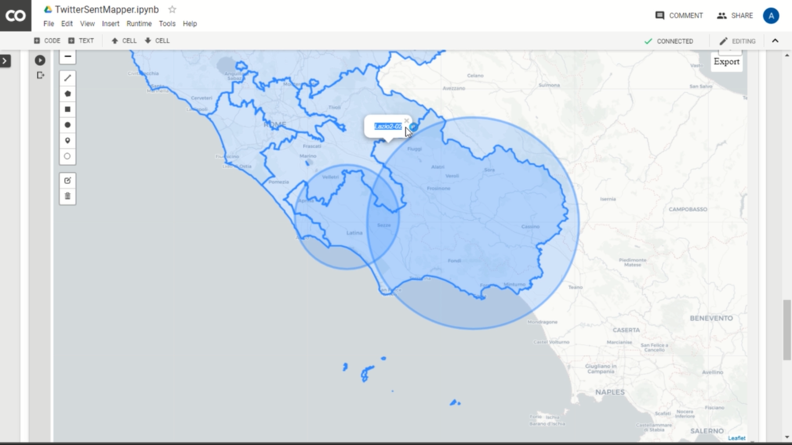

# TwitterSentMapper
### Link to the [TwitterSentMapper google colab notebook](https://colab.research.google.com/drive/17x-UvTu1yiDXF5dARum5M4QG7NsBf7-w#scrollTo=Z3PGOiIF1Nib).

### Click down for a video tutorial on how to use the TwitterSentMapper notebook 

### Link to MAP for [2018 ITALIAN ELECTION](http://www.elezioni2018-twitterpoliticalsentiment.com/Senato/)
(Not terribly predictive but still a good application of the program)
